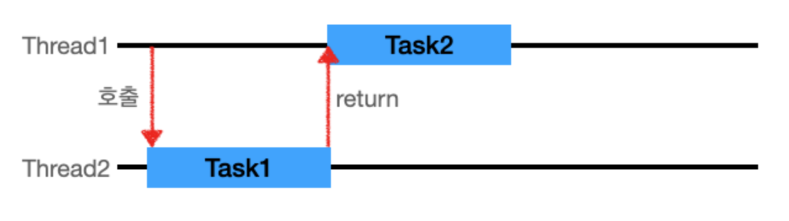
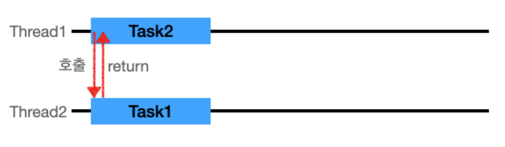
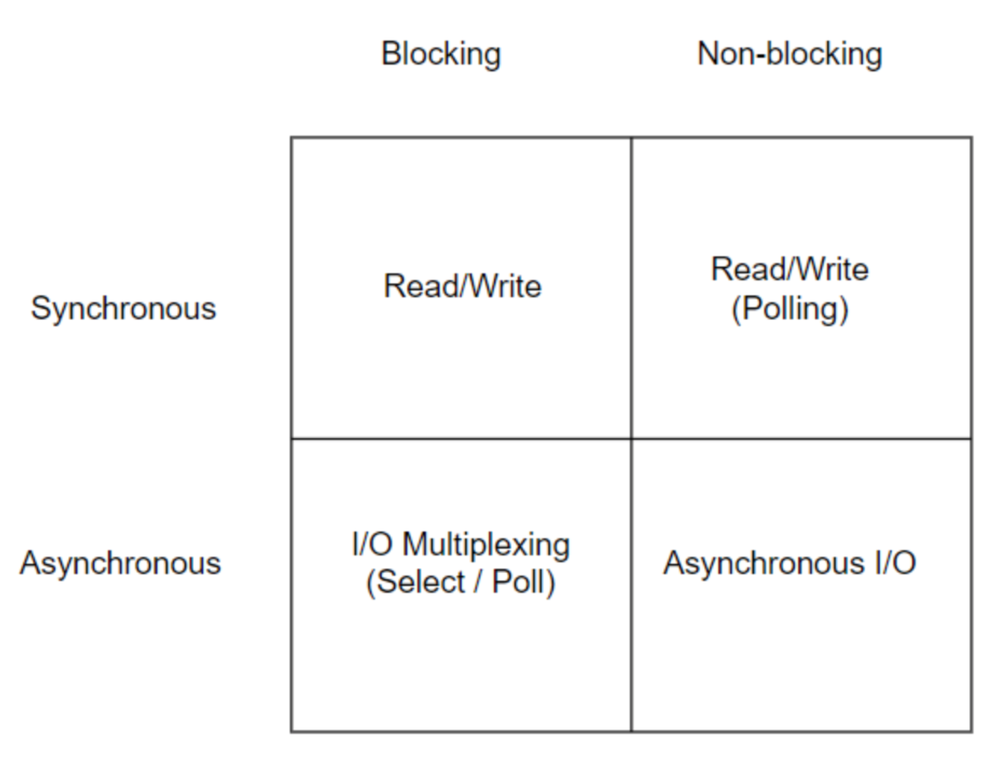
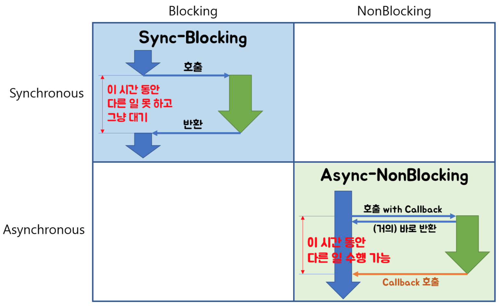
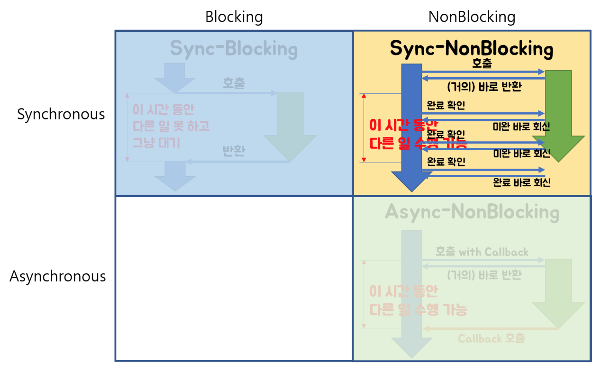
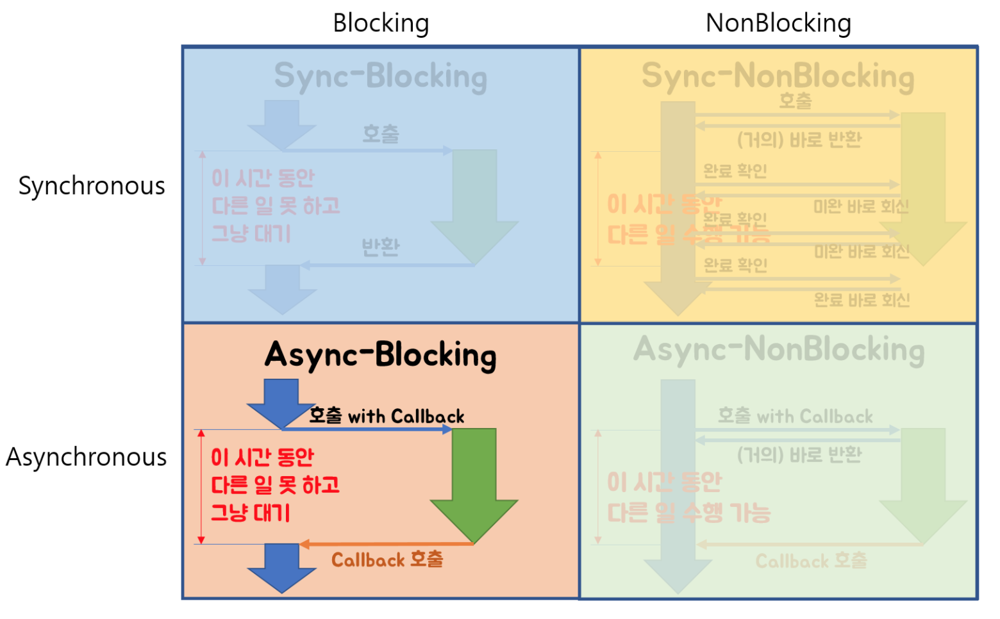

## 동기(Synchronous) vs 비동기(Asynchronous)

### 동기(Synchronous)

동기(Synchronous)

-   Thread1이 작업을 시작 시키고, Task1이 끝날때까지 기다렸다 Task2를 시작한다.
-   작업 요청을 했을 때 요청의 **결과값(return)을 직접 받는 것이다.**
-   요청의 결과값이 return값과 동일하다.
-   **호출한 함수가 직업 완료를 신경쓴다.**

### 비동기(Asynchronous)

-   Thread1이 작업을 시작 시키고, 완료를 기다리지 않고, Thread1은 다른 일을 처리할 수 있다.
-   작업 요청을 했을 때 요청의 **결과값(return)을 간접적으로 받는것이다.**
-   요청의 결과값이 return 값과 다를 수 있다.
-   해당 요청 작업은 별도의 스레드에서 실행하게 된다.
-   콜백을 통한 처리가 비동기 처리라고 할 수 있다.
-   **호출된 함수(callback 함수)가 작업 완료를 신경쓴다.**

---

## Blocking vs Non-Blocking

blocking과 non-blocking은 주로 IO의 읽기, 쓰기에서 사용된다.

### Blocking

-   **요청한 작업을 마칠 때까지 계속 대기**한다.
-   즉시 return한다.
-   return 값을 받아야 끝난다.
-   Thread 관점으로 본다면, 요청한 작업을 마칠 때까지 계속 대기하며 return 값을 받을 때까지 한 Thread를 계속 사용/대기 한다.

### Non-Blocking

-   **요청한 작업을 즉시 마칠 수 없다면 즉시 return** 한다.
-   즉시 리턴하지 않는다. (일을 못하게 막는다.)
-   Thread 관점으로 본다면, 하나의 Thread가 여러 개의 IO처리 가능하다.

---

## 동기/비동기, Blocking/Non-Blocking의 차이는?

동기와 blocking이 비슷하고, 비동기와 non-blocking이 비슷해 보인다.

### 관심사 관점으로서의 차이

#### blocking/non-blocking

> 이 그룹은 호출되는 함수가 바로 return하느냐 마느냐가 관심사이다.

-   호출된 함수가 바로 **return 해서 호출한 함수에게 제어권을 넘겨주고 호출한 함수가 다른 일을 할 수 있는 기회**를 줄 수 있으면 non-blocking이다.
-   호출된 함수가 **자신의 작업을 모두 마칠 때까지** 호출한 함수에게 **제어권을 넘겨주지 않고 대기**하게 만든다면 blocking이다.

#### 동기/비동기

> 이 그룹은 호출되는 함수의 작업 완료 여부를 누가 신경쓰느냐가 관심사이다.

-   호출되는 함수에게 **callback**을 전달해서 호출되는 함수의 작업이 완료되면 호출되는 함수가 전달받은 callback을 실행하고, **호출한 함수는 작업 완료 여부를 신경쓰지 않는다면 비동기**이다.
-   호출하는 함수가 호출되는 함수의 작업 완료 후 **return을 기다리거나** 호출되는 함수로부터 바로 return 받더라도 **작업 완료 여부를 호출한 함수 스스로 확인하며 신경 쓴다면 동기**이다.

### 동작 관점으로서의 차이

-   non-blocking은 제어문 수준에서 지체없이 반환하는 것
-   Asynchronous는 별도의 쓰레드로 빼서 실행하고, 완료되면 호출하는 측에 알려주는 것

### 입장으로서의 차이

-   blocking/non-blocking은 호출한 입장에서의 특징
-   Sync/Async는 처리되는 방식의 특징

---

## Sync/Async, Blocking/Non-Blocking 조합

### blocking + Synchronous, non-blocking + Asynchronous

blocking+synchronous

-   결과가 처리되어 나올때까지 기다렸다가 return으로 결과를 전달한다.

non-blocking + Asynchronous

-   작업 요청을 받아서 별도의 프로세서에게 진행하게 하고 바로 return(작업 끝) 한다. 결과는 별도의 작업 후 간접적으로 전달(callback) 한다

---

### non-blocking+Synchronous

결과가 없다면 바로 return 한다. 결과가 있으면 바로 결과를 return한다.

결과가 생길때까지 계속 완료되었는지 확인

---

### blocking + Asynchronous

호출되는 함수가 바로 return 하지 않고, 호출하는 함수는 작업 완료 여부를 신경쓰지 않는다.

이 조합은 이점이 없어서 일부러 이 방식을 사용하진 않는다.

의도하지 않게 blocking+async로 동작하는 경우가 있다. 이는 non-blocking+async를 추구하다가 의도가 변질된 경우 인데, 대표적으로 Node.js + MySQL 조합이라고 한다.

---

### 예시

> 상황 : 급하게 알아야 하는 답을 누군가에게 물어봐야하는 상황

-   전화로 물어봐서 즉답을 얻는다 = 동기 요청처리
-   이메일로 물어보고 메일 송신을 완료(return)했지만 답은 언제 올지 모른다 = 비동기 요청 처리
-   전화를 했는데 상대방이 너무 바빠 전화를 받지 않음을. 전화를 받을때까지 계속 대기 = 동기 + 블록킹
-   전화를 했는데 안 받음. 끊었다가 나중에 다시 전화함. 계속 반복했다가 어느 순간에 받아서 답을 얻음 = 동기 + 논블록킹

---

출처

-   [http://homoefficio.github.io/2017/02/19/Blocking-NonBlocking-Synchronous-Asynchronous/](http://homoefficio.github.io/2017/02/19/Blocking-NonBlocking-Synchronous-Asynchronous/)
-   [https://grip.news/archives/1304](https://grip.news/archives/1304)
-   [https://velog.io/@wonhee010/%EB%8F%99%EA%B8%B0vs%EB%B9%84%EB%8F%99%EA%B8%B0-feat.-blocking-vs-non-blocking](https://velog.io/@wonhee010/%EB%8F%99%EA%B8%B0vs%EB%B9%84%EB%8F%99%EA%B8%B0-feat.-blocking-vs-non-blocking)
