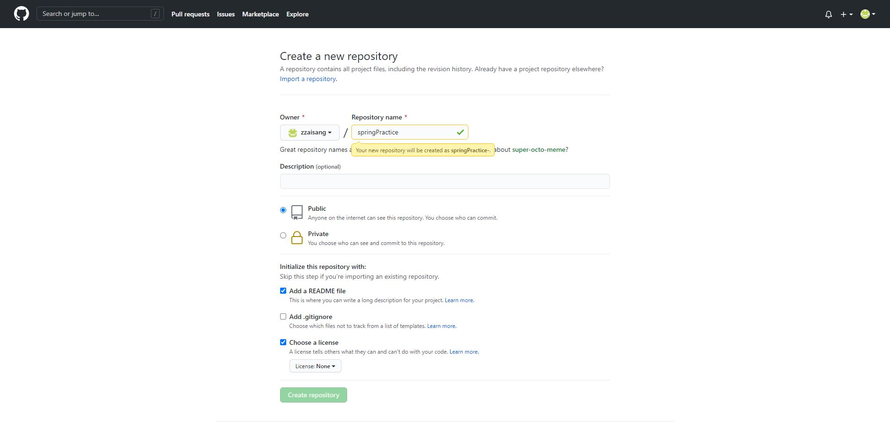
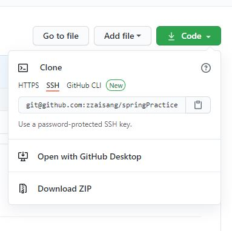

1\. gitHub 로그인

2\. New Repository 클릭 (사진1)



사진1

-   프로젝트 이름 설정 후 Remote 저장소 생성

3\. 해당 github 주소 복사 code 버튼 클릭시 노출

( 저는 현재 ssh Key 등록이 되어 있습니다. 안되신분은 https 로 하세요)



4\. Local 프로젝트에서 원격 저장소로 연결하기

```bash
git remote -v
//원격 저장소가 연결 되어 있지 않으면 추가
git remote add origin git@github.com:zzaisang/springPractice.git
```


5\. 프로젝트 연결 후 최초 커밋

6\. 커밋 후 푸시

소스링크 : [github.com/zzaisang/springPractice](https://github.com/zzaisang/springPractice)
