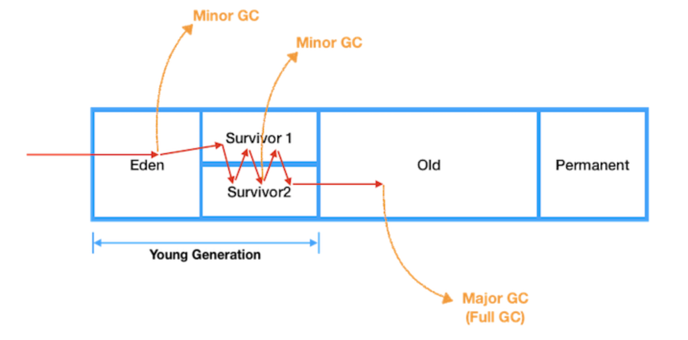

## GC (Garbage Collector)란

C/C++ 언어와 달리 자바는 개발자가 명시적으로 객체를 해제할 필요가 없습니다. 자바 언어의 큰 장점이기도 합니다. 사용하지 않는 객체는 메모리에서 삭제하는 작업을 GC라고 부르며 JVM에서 GC를 수행합니다.

기본적으로 JVM의 메모리는 총 5가지 영역(class, stack, heap, native method, PC)으로 나뉘는데, GC는 힙 메모리만 다룹니다.

일반적으로 다음과 같은 경우에 GC의 대상이 됩니다.

1.  객체가 NULL인 경우 (ex. String str = null)
2.  블럭 실행 종료 후, 블럭 안에서 생성된 객체
3.  부모 객체가 NULL인 경우, 포함하는 자식 객체

### GC 동작원리

-   JVM에서 GC의 스케줄링을 담당하여 Java 개발자에게 메모리 관리의 부담을 덜어준다.
-   GC는 background에서 데몬 쓰레드로 돌며 더이상 사용되지 않는 객체들을 메모리에서 제거하여 효율적인 메모리 사용을 돕는다.
-   어떻게 더이상 사용되지 않는 객체로 인식할까?
-   객체는 힙 영역에 저장되고 스택 영역에 이를 가리키는 주소값이 저장되는데 참조되지 않는(자신을 가리키는 포인터가 없는, unreachable) 객체를 메모리에서 제거한다.

GC

### GC 물리적 공간 (Heap 영역)

1.  Young generation
    1.  Eden
        -   새로 생성된 객체들이 위치
        -   Minor GC 발생
    2.  Survivor 1,2
        -   Eden 영역에서 GC 실행 후 살아남은 객체들이 위치
        -   Minor GC 발생
2.  Old generation
    -   Suvivor 영역에서 여러번의 GC 후 살아남은 객체들이 위치
    -   Major GC 또는 Full GC 발생

---

\- **Minor GC : New 영역에서 일어나는 GC**

1\. 최초에 객체가 생성되면 Eden영역에 생성된다.

2\. Eden영역에 객체가 가득차게 되면 첫 번째 CG가 일어난다.

3\. survivor1 영역에 Eden영역의 메모리를 그대로 복사된다. 그리고 survivor1 영역을 제외한 다른 영역의 객체를 제거한다.

4\. Eden영역도 가득차고 survivor1영역도 가득차게된다면, Eden영역에 생성된 객체와 survivor1영역에 생성된 객체 중에 참조되고 있는 객체가 있는지 검사한다.

5\. 참조 되고있지 않은 객체는 내버려두고 참조되고 있는 객체만 survivor2영역에 복사한다.

6\. survivor2영역을 제외한 다른 영역의 객체들을 제거한다.

7\. 위의 과정중에 일정 횟수이상 참조되고 있는 객체들을 survivor2에서 Old영역으로 이동시킨다.

\- 위 과정을 계속 반복, survivor2영역까지 꽉차기 전에 계속해서 Old로 비움

\- **Major GC(Full GC) : Old 영역에서 일어나는 GC**

1\. Old 영역에 있는 모든 객체들을 검사하며 참조되고 있는지 확인한다.

2\. 참조되지 않은 객체들을 모아 한 번에 제거한다.

\- Minor GC보다 시간이 훨씬 많이 걸리고 실행중에 GC를 제외한 모든 쓰레드가 중지한다.

---

### STW

-   Old 영역이 가득차면 major GC 또는 Full GC가 동작하는데 이때 STW 상태가 되므로 이를 최소화 하는 것이 중요하다.
-   STW(Stop-The-World)
    -   GC 처리하는 동안 Java의 프로세스가 모두 멈춰버리는 현상이다.

### GC 처리방식

1.  Serial GC
    -   Mark-sweep-compact 알고리즘
    -   적은 메모리와 CPU 코어 갯수가 적을 때 적합하다.
2.  Paraller GC
    -   Serial GC와 알고리즘은 같지만 GC를 처리하는 Thread가 여러개이다.
    -   메모리와 코어가 충분할 때 적합하다.
3.  Paraller Old GC
    -   Paraller GC에서 Old GC 알고리즘을 개선한 버전이다.

---

출처 

-   [https://jeong-pro.tistory.com/148](https://jeong-pro.tistory.com/148)
-   [https://wooody92.github.io/java/GC-%EB%8F%99%EC%9E%91%EC%9B%90%EB%A6%AC/](https://wooody92.github.io/java/GC-%EB%8F%99%EC%9E%91%EC%9B%90%EB%A6%AC/)
