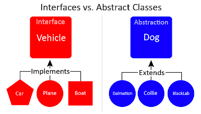

*주제 내용을 알기전에 is-a 개념과 has-a 개념을 알고갑시다.*

### 객체 지향적 관점 Is-a vs Has-a

### is-a

-   말 그대로 'A는 B이다'일 때의 '~이다'와 같습니다.

더보기

> **is-a**는 추상화(형식이나 클래스와 같은)들 사이의 포함 관계를 의미하며, 한 클래스 A가 다른 클래스 B의 서브클래스(파생클래스)임을 이야기합니다. 다른 말로, 타입 A는 타입 B의 명세(*specification*)를 암시한다는 점에서 타입 B의 서브타입이라고도 할 수 있습니다.
> 
>   
> is-a 관계는 타입 또는 클래스 간의 has-a 관계와는 대조됩니다. has-a 및 is-a 관계들 간의 혼동은 실세계 관계 모델에 대한 설계에 있어 자주 발견되는 에러입니다. is-a 관계는 또한 객체 또는 타입 간의 **instance-of** 관계와도 대조됩니다.

### has-a

-   '~을 할 수 있는"과 같습니다.

더보기

**has-a**는 구성 관계를 의미하며 한 오브젝트(구성된 객체, 또는 부분/멤버 객체라고도 부릅니다)가 다른 오브젝트(composite type이라고 부릅니다)에 "속한다(*belongs to*)"를 말합니다. 단순히 말해, has-a 관계는 객체의 멤버 필드라고 불리는 객체를 말하며, Multiple has-a 관계는 소유 계층구조를 형성하기 위해 결합하는 경우를 말합니다.

---

**Interface와 Abstract Class**는 **상속(extends)받거나, 구현(implements)하는 Class**가 Interface나 Abstract Class 안에 있는 **Abstract Method를 구현하도록 강제하는 공통점**을 가지고 있다.

그렇다면 Interface와 Abstract Class 두 종류가 존재하는건 왜일까?

**결론**부터 말하자면, **Interface와 Abstract Class는 존재 목적이 다르다.**



## **Interface**

**Interface**는 부모, 자식 관계인 **상속 관계에 얽메이지 않고**, 공통 기능이 필요 할때, **Abstract Method를 정의해놓고 구현(implements)**하는 Class에서 **각 기능들을 Overridng**하여 **여러가지 형태로 구현**할 수 있기에 **다형성과 연관**되어 있다.

Interface는 **해당 Interface를 구현하는 Class들에 대해 동일한 method, 동작을 강제하기 위해 존재**한다.  
Java에서 다중 상속이 안되어 발생하는 Abstract Class의 한계도 보완해줄 수 있다.  
Interface의 implements에는 제한이 없어 다중 구현이 가능하다.

**하지만 모든 Class가 Interface를 이용**한다면, **공통적으로 필요한 기능도 implements하는 모든 Class에서 Overrindg해 재정의해야 하는 번거로움이 존재**한다.

**Interface는 각각 다른 Abstract Class를 상속하는 Class들**의 **공통 기능을 명시할때 사용하면 편리**하다.

---

## **Abstract Class**

**Abstract Class**는 **부모와 자식 즉, 상속 관계**에서 **Abstract Class를 상속(extends)받으며** **같은 부모 Class(여기서는 Abstract Class)를 상속**받는 **자식 Class들 간에 공통 기능을 각각 구현하고, 확장**시키며 **상속과 관련**되어 있다.  
상속은 SuperClass의 기능을 이용, 확장 하기 위해 사용된다.

더보기

Abstract Class는 IS - A "~이다"이고, Interface는 HAS - A "~을 할 수 있는"이다.

**Abstract Class를 상속하며 Class들간의 구분이 가능**해진다.  
  

**Java에서는 다중 상속을 지원하지 않기 때문**에 **Abstract Class 만으로 구현해야하는 Abstract Method를 강제하는데는 한계가 존재**한다.

-   Example

```java
class Vehicle extends Car, Motorcycle {
    @Override
    public void run(){
        super.drive();
    }
}
```

만약 Java에서 다중 상속이 가능했다면 Car, Motocycle에 각각 drive method가 정의되어 있을 경우 무엇을 상속받아 Overridng 한건지 모호해진다.

이것이 **다중 상속의 모호성**이고, **이 때문에 Java는 다중 상속을 막아 놓았다.**

---

출처

-   [https://velog.io/@gillog/Java-Interface-vs-Abstract-Class-%EC%A0%95%EB%A6%AC](https://velog.io/@gillog/Java-Interface-vs-Abstract-Class-%EC%A0%95%EB%A6%AC)
-   [https://minusi.tistory.com/entry/%EA%B0%9D%EC%B2%B4-%EC%A7%80%ED%96%A5%EC%A0%81-%EA%B4%80%EC%A0%90%EC%97%90%EC%84%9C%EC%9D%98-has-a%EC%99%80-is-a-%EC%B0%A8%EC%9D%B4%EC%A0%90](https://minusi.tistory.com/entry/%EA%B0%9D%EC%B2%B4-%EC%A7%80%ED%96%A5%EC%A0%81-%EA%B4%80%EC%A0%90%EC%97%90%EC%84%9C%EC%9D%98-has-a%EC%99%80-is-a-%EC%B0%A8%EC%9D%B4%EC%A0%90)
-   [http://alecture.blogspot.com/2011/05/abstract-class-interface.html](http://alecture.blogspot.com/2011/05/abstract-class-interface.html)​
