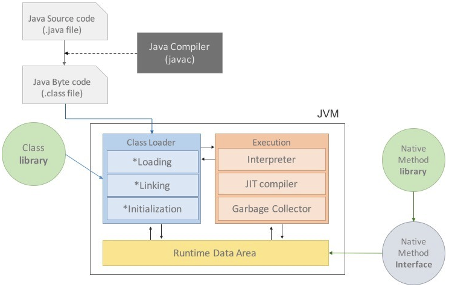
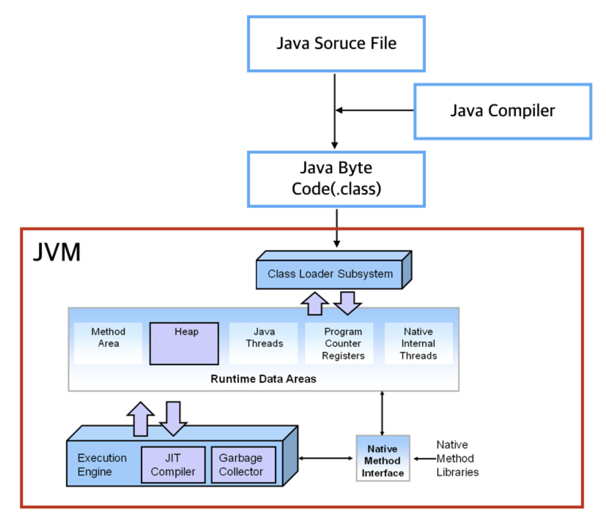

## JVM의 역할

-   Application ClassLoader를 통해 읽어 들여 Java API와 함께 실행.
-   Java와 OS 사이에서 중개자 역할을 수행한다. Java Byte Code (.class file)를 OS에 맞게 해석하여 JVM 위에서 OS와 상관없이 실행된다.
-   JVM은 스택기반의 가상 머신이며, 메모리 관리와 Garbage Collection을 수행한다.

JVM 구성도

JVM 구성도 (메모리구조 포함)

## Java 프로그램 실행과정

1.  프로그램이 실행되면 OS가 JVM에게 필요한 메모리를 할당한다.
2.  Java 컴파일러(javac)가 자바 소스 코드(. java)를 읽어 자바 바이트코드(.class)로 변환한다.
3.  Class Loader를 통해 class 파일들을 JVM으로 로딩한다.
4.  로딩된 class파일들은 Execution Engine을 통해 해석된다.
5.  해석된 바이트코드는 Runtime Data Areas에 배치되어 실질적인 수행이 이루어지게 된다.

## JVM 구조

### Class Loader

-   Runtime 시점에 클래스(.class)를 로드하고, 클래스의 인스턴스를 생성하면 클래스 로더를 통해 메모리에 로드하게 된다.
-   jar 파일 내 저장된 클래스들을 JVM 위에 올리고 사용하지 않는 클래스들을 메모리에서 삭제한다.

### Execution Engine

-   클래스를 실행시키는 역할. 클래스 로더가 JVM 내의 Runtime Data Areas에 바이트 코드를 배치시키고, 이것은 Execution Engine에 의해 실행된다.
-   자바 바이트 코드는 기계가 바로 수행할 수 있는 언어보다는 비교적 인간이 보기 편한 형태로 기술된 것이다.
-   Execution Engine은 이러한 바이트코드를 JVM내부에서 인터프리터 혹은 JIT(Just In Time) 방식을 통해 기계가 실행할 수 있는 형태로 변환한다.

---

참고 : [https://wooody92.github.io/java/JVM/](https://wooody92.github.io/java/JVM/)
