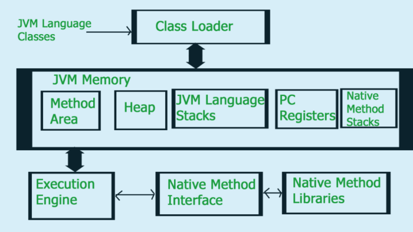
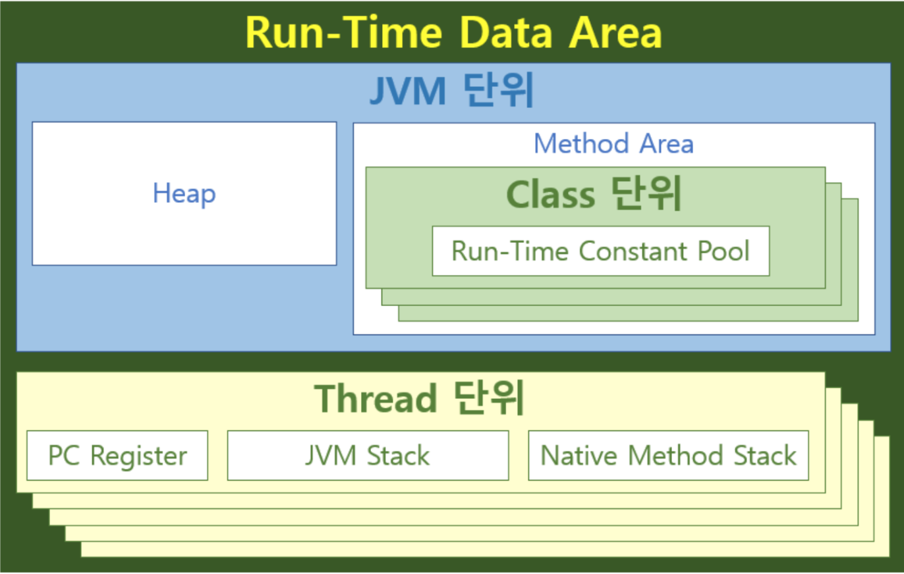

### 메소드 영역

JVM 이 읽어들인 각각의 클래스와 인터페이스에 대한 런타임 정보, static 변수, 메소드 바이트코드 저장.  JVM당 1개의 영역이 있으며 이는 공유된다.

### 힙영역

인스턴스 또는 객체를 저장. GC 대상으로 JVM 성능에 대한 이슈가 가장 많이 언급. JVM 당 하나의 영역만 존재하며 공유한다.

### 스택영역

모든 스레드에 대해 JVM은 여기에 저장된 하나의 런타임 스택을 만들게 된다. 이 스택을 활성화 레코드 / 스택프레임이라고 한다.  
해당 메소드의 모든 로컬 변수는 프레임에 저장된다. 스레드가 종료된 후에는 런타임 스택이 JVM 에 의해 삭제된다. 공유되지 않는다.

### PC 레지스터

각 스레드 마다 존재하며, 스레드 시작시에 생성. JVM 이 수행할 명령어의 주소를 저장.

스레드의 현재 실행 명령의 주소를 저장한다. 각 스레드는 별도의 PC 레지스터를 보유한다.

### 원시 메소드 스택

Java Native interface 호출 및 종료시 생성. 바이트코드가 아닌, 기계어로 작성된 코드 실행.

---



여기서 '단위'라는 구분 단계를 추가한 이유는 스팩에도 per-class, per-thread 라는 표현이 나오기 때문인데, 여기에서의 '단위'는 생명주기와 생성 단위를 의미한다.  
JVM 단위에 속하는 힙과 메서드 영역은 JVM이 시작될 때 생성되고, JVM이 종료될 때 소멸되며, JVM 하나에 힙 하나, 메서드 영역도 하나가 생성 된다.  
마찬가지로 클래스 단위에 속하는 런타임 상수 풀은 클래스가 생성/소멸될 때 함께 생성/소멸되며, 클래스 하나에 런타임 상수 풀도 하나가 생성 된다.  
스레드 단위에 속하는 PC 레지스터, JVM 스택, 네이티브 메서스 스택도 스레드가 생성/소멸될 때 함께 생성/소멸되며, 스레드 하나에 PC 레지스터, JVM 스택, 네이티브 메서드 스택도 각 하나씩 생성된다.

## 예제 코드

HelloWorld 수준의 단순한 소스 코드다. 힙에서 객체가 생성되는 것을 확인하기 위해서 Hello 인스턴스를 만들고 무한 루프로 프로그램의 종료를 일부러 막아둔 코드다.

```java
public class Hello {
    public static void main(String[] args) {        
                final Hello hello = new Hello();        
                System.out.println(hello.helloMessage());
        while (true) {}    
        }    

        public String helloMessage() {
        return "Hello, JVM";    
        }
}
```

### 컴파일된 바이트 코드

더보기

javap -v -p -s homo/efficio/jvm/sample/Hello.class

```bash
$ /c/Program\ Files/Java/jdk-11.0.2/bin/javap -v -p -s homo/efficio/jvm/sample/HelloClassfile /C:/gitrepo/scratchpad/java-jvm-scratchpad/out/production/java-jvm-scratchpad/homo/efficio/jvm/sample/Hello.class
Last modified 2019. 1. 30.;
size 741 bytes  MD5 checksum 675e63b96993dc5e661d6566467d92d3  Compiled from "Hello.java"public class homo.efficio.jvm.sample.Hello  minor version: 0  major version: 55  flags: (0x0021) ACC_PUBLIC, ACC_SUPER  this_class: #2                          
// homo/efficio/jvm/sample/Hello  super_class: #8
// java/lang/Object  interfaces: 0, fields: 0, methods: 3, attributes: 1Constant pool:   #1 = Methodref          #8.#26         
// java/lang/Object."<init>":()V   #2 = Class              #27            
// homo/efficio/jvm/sample/Hello   #3 = Methodref          #2.#26         
// homo/efficio/jvm/sample/Hello."<init>":()V   #4 = Fieldref           #28.#29        
// java/lang/System.out:Ljava/io/PrintStream;   #5 = Methodref          #2.#30         
// homo/efficio/jvm/sample/Hello.helloMessage:()Ljava/lang/String;   #6 = Methodref          #31.#32        
// java/io/PrintStream.println:(Ljava/lang/String;)V   #7 = String             #33            
// Hello, JVM   #8 = Class #34            
// java/lang/Object   #9 = Utf8 <init>  #10 = Utf8 ()V  #11 = Utf8 Code  #12 = Utf8 LineNumberTable  #13 = Utf8 LocalVariableTable  #14 = Utf8 this  #15 = Utf8 Lhomo/efficio/jvm/sample/Hello;  #16 = Utf8 main  #17 = Utf8 ([Ljava/lang/String;)V  #18 = Utf8 args  #19 = Utf8 [Ljava/lang/String;#20 = Utf8 hello  #21 = Utf8 StackMapTable  #22 = Utf8 helloMessage  #23 = Utf8 ()Ljava/lang/String;  #24 = Utf8 SourceFile  #25 = Utf8 Hello.java  #26 = NameAndType #9:#10 
// "<init>":()V  #27 = Utf8 homo/efficio/jvm/sample/Hello  #28 = Class #35 
// java/lang/System  #29 = NameAndType #36:#37 
// out:Ljava/io/PrintStream;  #30 = NameAndType #22:#23 
// helloMessage:()Ljava/lang/String;  #31 = Class #38 
// java/io/PrintStream  #32 = NameAndType #39:#40 
// println:(Ljava/lang/String;)V  #33 = Utf8 Hello, JVM  #34 = Utf8 java/lang/Object  #35 = Utf8 java/lang/System  #36 = Utf8 out  #37 = Utf8 Ljava/io/PrintStream;  #38 = Utf8 java/io/PrintStream  #39 = Utf8 println  #40 = Utf8 (Ljava/lang/String;)V{  public homo.efficio.jvm.sample.Hello(); descriptor: ()V flags: (0x0001) ACC_PUBLIC Code: stack=1, locals=1, args_size=1 0: aload_0 1: invokespecial #1 
// Method java/lang/Object."<init>":()V 4: return LineNumberTable: line 3: 0 LocalVariableTable: Start  Length  Slot  Name Signature 0 5 0  this   Lhomo/efficio/jvm/sample/Hello;  public static void main(java.lang.String[]);    descriptor: ([Ljava/lang/String;)V    flags: (0x0009) ACC_PUBLIC, ACC_STATIC Code: stack=2, locals=2, args_size=1 0: new #2 
// class homo/efficio/jvm/sample/Hello 3: dup 4: invokespecial #3 
// Method "<init>":()V 7: astore_1 8: getstatic #4 
// Field java/lang/System.out:Ljava/io/PrintStream; 11: aload_1 12: invokevirtual #5 
// Method helloMessage:()Ljava/lang/String; 15: invokevirtual #6 
// Method java/io/PrintStream.println:(Ljava/lang/String;)V 18: goto 18 LineNumberTable: line 6: 0 line 7: 8 line 8: 18 LocalVariableTable: Start  Length  Slot  Name Signature 0 21 0  args [Ljava/lang/String; 8 13 1 hello Lhomo/efficio/jvm/sample/Hello; StackMapTable: number_of_entries = 1 frame_type = 252 /* append */ offset_delta = 18 locals = [ class homo/efficio/jvm/sample/Hello ]  public java.lang.String helloMessage(); descriptor: ()Ljava/lang/String; flags: (0x0001) ACC_PUBLIC Code: stack=1, locals=1, args_size=1 0: ldc #7 
// String Hello, JVM 2: areturn LineNumberTable: line 12: 0 LocalVariableTable: Start  Length  Slot  Name Signature 0 3 0 this Lhomo/efficio/jvm/sample/Hello;}SourceFile: "Hello.java"
```
