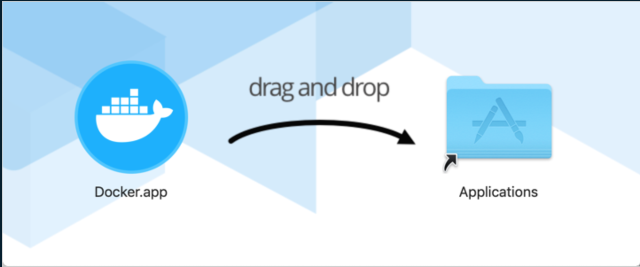

Docker Desktop version : 4.3.0

OS version : MacOs Big Sur 11.6

---

## 동작 환경

Docker Desktop 4.3.0부터 Rosetta 2를 설치하기 위한 하드 요구 사항을 제거했습니다. Darwin/AMD64를 사용할 때 Rosetta 2가 여전히 필요한 몇 가지 선택적 명령줄 도구가 있습니다. 그러나 최상의 경험을 얻으려면 Rosetta 2를 설치하는 것이 좋습니다. 

#### Rosetta 설치 

```bash
$ softwareupdate --install-rosetta
```

#### Docker 설치 파일  다운로드 (아래 링크)

#### [https://desktop.docker.com/mac/main/arm64/Docker.dmg?utm\_source=docker&utm\_medium=webreferral&utm\_campaign=docs-driven-download-mac-arm64](https://desktop.docker.com/mac/main/arm64/Docker.dmg?utm_source=docker&utm_medium=webreferral&utm_campaign=docs-driven-download-mac-arm64 "Docker Desktop for mac M1")

#### Docker 설치 파일 실행 



 완료!

---

출처 : [https://docs.docker.com/desktop/mac/apple-silicon/](https://docs.docker.com/desktop/mac/apple-silicon/)

 [Docker Desktop for Apple silicon

docs.docker.com](https://docs.docker.com/desktop/mac/apple-silicon/)
