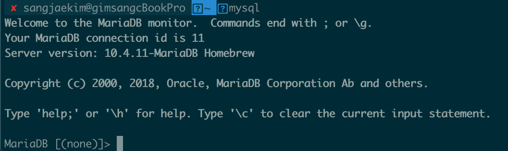

# Maria DB Local 세팅하기

### 환경 
 - MAC OS 

## 설치
 - Homebrew 로 설치.
```bash
brew update 
brew install mariadb 
```
 - 따로 mariadb 버전을 세팅하지 않으면 최신버전이 설치된다.
 - 설치가 완료되면 해당 문구처럼 로깅이 찍힐것이다.
```
MySQL is configured to only allow connections from localhost by default

To connect:
    mysql -uroot

To have launchd start mariadb now and restart at login:
  brew services start mariadb
Or, if you don't want/need a background service you can just run:
  mysql.server start
==> Summary
🍺  /usr/local/Cellar/mariadb/10.4.11: 742 files, 168MB
```

## 로컬 서버 세팅

 - 서버 시작
```bash
mysql.server start
```
 - mysql 서버 접속 (완료되면 아래 이미지 처럼 나온다.)
```bash
mysql
```


### root 계정 비밀번호 설정 

```sql
UPDATE user SET authentication_string=PASSWORD('###') where User='root'; #(###은 비밀번호)
FLUSH PRIVILEGES;
```

### database(schema) 생성 및 유저 생성 후 권한 부여
```sql
CREATE DATABASE ysf_dev;
CREATE USER 'ysf_dev'@'%'IDENTIFIED BY '1234';
GRANT ALL PRIVILEGES on ysf_dev.* TO 'ysf_dev'@'%';
FLUSH PRIVILEGES;
```
