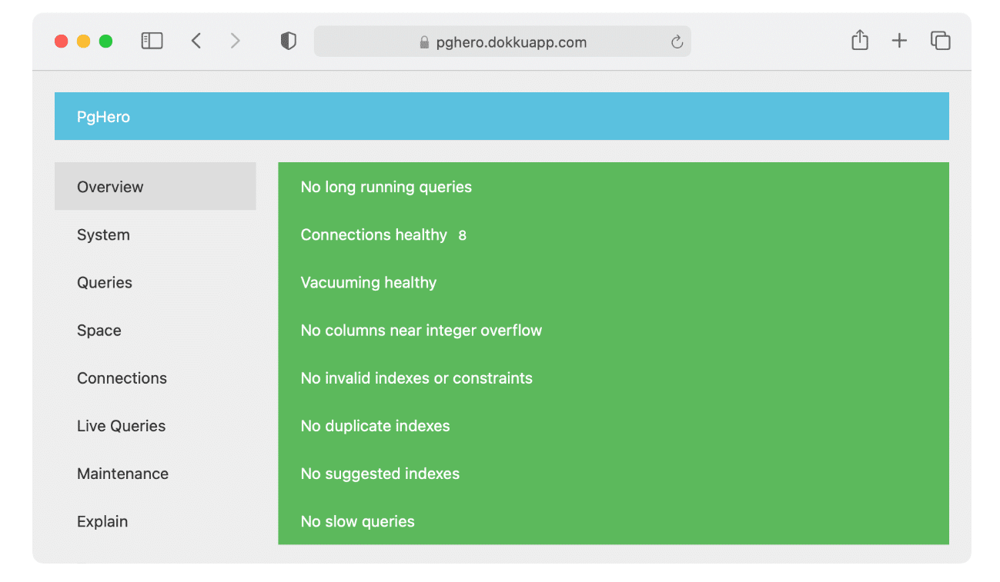

## MariaDB 와 PostgreSQL 비교

### **1\. 아키텍처 / 문서 모델**

MariaDB와 PostgreSQL 모두 관계형 데이터베이스 관리 시스템(RDBMS)을 기본 데이터베이스 모델로 사용합니다.  
보조 데이터베이스 모델은 문서 저장소입니다. 그러나 MariaDB만이 그래프 DBMS도 통합할 수 있습니다.  
MariaDB와 PostgreSQL 모두 클라이언트/서버 아키텍처 모델을 사용합니다. 여기서 서버는 데이터베이스 파일 관리를 담당하고, 클라이언트 애플리케이션에서 데이터베이스에 대한 연결을 수락하고, 클라이언트를 대신하여 데이터베이스 작업을 수행합니다. 클라이언트 또는 프런트엔드 애플리케이션은 일반적으로 데이터베이스 작업을 수행합니다.

### **2\. 확장성**

MariaDB와 PostgreSQL 모두 사용자 지정을 위한 확장 가능한 아키텍처를 포함합니다. 필요에 따라 특정 추가 기능이 필요한 사용자는 개발자가 원하는 대로 코드를 사용자 지정할 수 있는 공유 라이브러리를 사용하여 이를 구현할 수 있습니다.  
MariaDB는 다양한 SQL 모드, 파티셔닝, 데이터베이스 백업 및 복원 절차, 서버 모니터링 및 로깅을 지원합니다. 함수, 데이터 유형, 연산자, 창 함수 또는 거의 모든 것을 만들 수도 있습니다. 마음에 드는 기능이 보이지 않습니까? 오픈 소스 라이선스 덕분에 소스 코드 자체에서 만들고 사용자 지정할 수 있습니다.  
PostgreSQL은 JSON 및 XML에 대한 기본 지원을 제공하지만 쉽게 확장할 수 있습니다. 따라서 웹 서비스를 구축하고 PostgreSQL을 백엔드 데이터베이스 시스템 으로 사용하거나 비즈니스 사용 사례에 대한 Python 맵 지원을 활용하려는 경우 딸꾹질에 대해 걱정할 필요 없이 사용할 수 있습니다.  
PostgreSQL을 확장 가능하게 만드는 것은 카탈로그 기반 작업입니다. PostgreSQL은 존재하는 데이터 유형, 함수 및 액세스 방법에 관한 세부 정보와 함께 열 및 테이블에 대한 모든 정보를 유지합니다.

### **3\. 인덱스**

MariaDB에는 네 가지 주요 인덱스 종류가 있습니다. 즉, 기본 키(고유하고 null이 아님); 고유 인덱스(고유하며 null일 수 있음) 일반 인덱스(반드시 고유하지 않음) 및 전체 텍스트 인덱스(전체 텍스트 검색용).  
PostgreSQL은 B-트리, 해시, GiST, SP-Gist, GIN 및 BRIN과 같은 모든 쿼리 워크로드를 효율적으로 일치시키기 위해 더 광범위한 고유 인덱스 유형을 제공합니다. PostgreSQL은 함수 기반 인덱스, 부분 인덱스, 상호 배타적이지 않은 포함 인덱스를 추가로 지원하므로 동시에 모두 사용할 수도 있습니다.  
또한 MariaDB와 PostgreSQL 모두 전체 텍스트 인덱싱 및 검색을 지원합니다.

### **4\. 언어 및 구문**

MariaDB와 PostgreSQL은 둘 다 C, C++, Perl, PHP 및 Python을 비롯한 다양한 데이터베이스 커넥터와 함께 다양한 SQL 문, 규칙, 함수 및 프로시저를 지원합니다.  
PostgreSQL은 공통 테이블 표현식(CTE), 언어 제어 구조(if, for, case 등) 및 구조화된 오류 처리도 구현할 수 있습니다.

### **5\. 파티셔닝**

MariaDB는 테이블의 수평 파티셔닝과 함께 Galera Cluster/Spider 스토리지 엔진을 사용한 샤딩을 통한 파티셔닝을 지원합니다. 이는 MariaDB의 쿼리 성능을 강화하는 데 도움이 됩니다. MariaDB를 사용하면 자주 액세스하는 최근 데이터를 거의 참조하지 않는 과거 데이터와 별도의 파티션에 저장하여 액세스 속도를 높일 수도 있습니다.  
반면에 PostgreSQL은 이들 중 어떤 것도 지원하지 않습니다. 미래에 어떤 일이 일어날지 기대하고 있지만 PostgreSQL에는 아직 테이블 파티셔닝 옵션이 없습니다.

### **6\. 속도**

PostgreSQL은 더 빠른 쓰기 및 읽기 기능을 제공하므로 처리 시간과 데이터 액세스 속도가 비즈니스 운영에서 중요한 역할을 하는 경우 권장되는 선택입니다. PostgreSQL은 또한 데이터베이스에서 처리할 데이터의 양이 상당할 때 선택해야 합니다.  
반면에 MariaDB는 쿼리 처리 속도 측면에서 PostgreSQL과 정면으로 맞설 수 있는 12개의 새로운 스토리지 엔진으로 더 빠르게 실행되고 최대 200,000개 이상의 연결을 지원할 수 있는 고급 스레드 풀을 수용합니다.

### **7\. 모니터링 및 관리도구**

#### **\- 기본 관리 도구**

다음 명령줄 응용 프로그램은 기본 관리 작업에 적합합니다.

-   psql(포스트그레SQL)
-   mysql(마리아DB, MySQL)

이러한 도구는 각각의 서버에 내장되어 있으므로 설치 즉시 **psql** 과 **mysql** 을 항상 사용할 수 있습니다. **psql** 과 **mysql** 모두 이전에 실행한 명령과 쿼리를 다시 실행할 수 있는 명령 기록과 데이터베이스와의 상호 작용을 용이하게 할 수 있는 기본 제공 명령 세트가 있습니다. 예를 들어 **psql** 은 **\\d** 명령을 사용하여 모든 데이터베이스를 나열하고 **mysql** 은 **status** 명령을 사용하여 서버 가동 시간 및 버전과 같은 정보를 추출합니다.  
MariaDB 및 PostgreSQL은 다음과 같은 공식 그래프 도구도 제공합니다.

-   pgAdmin4(PostgreSQL)
-   MySQL 워크벤치(MariaDB, MySQL)

#### **\- 성능 대시보드 도구**

앞서 언급한 명령줄 및 그래프 애플리케이션 외에도 MariaDB와 PostgreSQL 모두 더 전문화된 다른 도구도 제공합니다. 이러한 도구 중 하나는 PostgreSQL에서 포괄적인 성능 대시보드로 만든 PgHero입니다.



PGero 대시보드 (이미지 출처: PgHero)

MariaDB에서는 PgHero와 동일한 목적으로 MySQL Tuner를 활용할 수 있습니다. MySQL Tuner는 데이터베이스 통계 및 설정을 분석하여 구성 권장 사항을 생성할 수 있는 Perl 스크립트입니다.

#### **로그 구문 분석 도구**

MariaDB의 pt-query-digest와 같은 로그 구문 분석 도구를 사용하여 느린 쿼리를 정확히 찾아낼 수 있습니다. Pt-query-digest는 로그를 분석하고 테스트 쿼리를 실행하여 가장 느린 쿼리를 식별하여 적절하게 최적화할 수 있습니다.  
PostgreSQL은 유사한 로그 구문 분석 목적으로 pgBadger를 제공합니다. SQL 트래픽을 분석하고 동적 그래프로 완성된 HTML5 보고서를 생성하는 빠르고 쉬운 도구입니다.

### **8\. 성능**

MariaDB는 소규모 데이터베이스에 적합한 것으로 간주되며 PostgreSQL에서 제공하지 않는 기능인 메모리에 데이터를 저장할 수 있습니다. 반면 PostgreSQL은 자주 액세스하는 데이터를 추출하기 위해 서버의 페이지 캐시와 함께 내부 캐시를 활용하므로 MariaDB의 쿼리 캐시를 능가할 수 있습니다.  
PostgreSQL은 또한 데이터베이스 성능을 최적화하기 위해 부분 인덱스 및 구체화된 보기와 같은 다양한 고급 기능을 제공합니다. 구체화된 뷰를 사용하면 비용이 많이 드는 집계 및 조인 작업을 미리 계산하고 결과를 데이터베이스 내의 테이블에 저장할 수 있으므로 자주 실행되는 복잡한 쿼리의 성능을 개선하고 대량의 데이터에 액세스하여 결과를 얻을 수 있습니다.  
부분 인덱스는 테이블의 모든 행이 아닌 쿼리 결과에 대해 생성됩니다. 대부분의 경우 쿼리는 높은 활동/최신성을 기반으로 테이블의 행 하위 집합만 사용합니다. 자주 액세스하는 행에서 오는 쿼리 결과에 대해 부분 인덱스를 생성하면 쿼리 실행 속도가 훨씬 빨라질 수 있습니다.  
이러한 기능은 집계를 생성하기 위해 자주 조인해야 하는 다양한 대형 테이블이 포함된 대규모 데이터 세트가 있는 경우에 유용합니다. 그러나 이러한 기능은 MariaDB에는 없습니다

### **9\. 가격**

MariaDB의 경우 라이선스 비용은 연간 약 $4,000입니다. 실제 가격은 귀하가 작성하는 게시물 수와 선택한 소프트웨어를 기반으로 합니다. MariaDB는 방대한 MariaDB 세계에 익숙해지려는 초보자에게 적합한 자체 호스팅 오픈 소스 옵션도 제공합니다.  
PostgreSQL은 작업 용이성, 다용성 및 확장성 때문에 전 세계 개발자가 널리 활용하는 온프레미스 오픈 소스 플랫폼으로 알려져 있습니다. 그러나 자주 지원이 필요하다고 생각되면 EnterpriseDB라고도 하는 PostgreSQL의 상용 버전을 사용해 볼 수 있습니다.

### **10\. 데이터 타이핑**

MariaDB는 데이터 유형 측면에서 PostgreSQL보다 더 유연합니다. 대상 데이터 유형과 일치하도록 데이터를 자동 수정하고 데이터를 수락하고 경고를 트리거할 수 있습니다. 따라서 MariaDB는 데이터 입력의 불일치에 직관적으로 반응해야 하는 애플리케이션에 적합합니다.  
반면에 PostgreSQL은 더 엄격한 유형입니다. 즉, 들어오는 데이터가 대상 데이터 유형과 약간 다른 경우 PostgreSQL은 오류를 발생시키고 삽입을 허용하지 않습니다. PostgreSQL은 엄격한 데이터 무결성을 지향합니다.

### **11\. 복제 및 클러스터링**

지연된 복제를 사용하면 보조 복제가 기본 복제보다 지연되는 시간(초)을 정의할 수 있습니다. 이것은 보조가 최근 어느 시점부터 기본의 상태를 반영하도록 하기 위한 것입니다.  
MariaDB는 비동기 다중 소스 복제 및 기본-보조 복제를 지원합니다. 이와 같이 MariaDB Galera Cluster를 통해 반 동기 복제, 다중 기본 클러스터링, 지연 복제 및 병렬 복제를 실행할 수 있습니다.  
반면 PostgreSQL은 계단식 복제, 스트리밍 복제 및 동기식 복제와 함께 1차-2차 복제 를 제공합니다. 최신 BDR 패키지를 활용하면 PostgreSQL에서 양방향 복제를 실행할 수도 있습니다.  
동기식 복제를 위한 쿼럼 커밋은 순서와 관계없이 주어진 수의 대기가 응답한 후 각 커밋이 얼마나 빨리 진행될지 지정할 수 있도록 함으로써 동기식 복제에서 더 큰 유연성을 제공합니다. 이를 통해 데이터베이스를 지속적으로 배포하고 업데이트할 수 있습니다.  
논리적 복제를 사용하면 테이블별 또는 데이터베이스별 수준의 수정 사항을 다른 PostgreSQL 데이터베이스로 보낼 수 있으므로 데이터가 데이터베이스 클러스터에 복제되는 방식을 미세 조정할 수 있습니다.

### **12\. 보안**

MariaDB는 MariaDB 커뮤니티의 보안 중요성을 반영하는 보안 패치를 자주 릴리스합니다.  
마찬가지로 PGDG(PostgreSQL 글로벌 개발 그룹)는 크고 활발한 커뮤니티에서 정기적으로 해결하는 활성 공통 노출 및 취약성의 광범위한 목록을 게시합니다.

### **13\. 크기**

MariaDB는 PostgreSQL에 비해 크기가 상당히 작으며 이는 다양한 OS 버전에 걸쳐 유지됩니다. MariaDB는 또한 훨씬 가볍기 때문에 메모리 할당이 부족한 경우 선호되는 선택입니다.

### **14\. 지원 및 커뮤니티**

MariaDB는 엔지니어(일반적으로 소프트웨어 개발자 및 데이터베이스 관리자)를 통해 지원을 제공하며 엔지니어는 MySQL 및 MariaDB의 기술 전문가이기도 합니다. 엔터프라이즈급 구독 사용자의 경우 MariaDB Corporation에는 광범위한 연중무휴 지원이 포함됩니다.  
자습서, 문서, 자습서 및 기타 유용한 리소스를 살펴볼 수 있는 MariaDB 기술 자료를 통해서도 지원이 제공됩니다.  
MariaDB는 개발자, 기여자 및 비개발자 그룹을 포함하는 활성 커뮤니티에 의존하고 헌신합니다. 소셜 미디어, 메일링 리스트, 이벤트 및 컨퍼런스를 통해 [커뮤니티 구성원과 상호 작용하는](https://mariadb.com/kb/en/community/) 다양한 방법을 찾을 수 있으며 MariaDB를 직접 디버그, 문서화 및 개발하도록 돕도록 권장됩니다.  
PostgreSQL 역시 사용자 그룹, 문서, 메일링 리스트, 사용자가 박식하고 활동적인 PostgreSQL 커뮤니티 구성원에게 쉽게 질문을 제기할 수 있는 IRC 채널을 포함한 보충 리소스를 통해 사용자에게 지원을 제공하는 활발하고 광범위한 커뮤니티를 보유하고 있습니다. PostgreSQL에 대한 여러 국제 사이트도 있으므로 해당 국가 및/또는 언어로 커뮤니티 참여 기회와 리소스를 찾을 수 있습니다.  
PostgreSQL 커뮤니티 페이지에는 메일링 리스트, 학습 기회, 채용 공고 등 다양한 참여 방법이 있습니다. 개발자 페이지는 PostgreSQL 프로젝트에 대해 자세히 알아보거나 활성 개발자가 될 수 있는 수단을 제공합니다. 다른 통신 및 참여 방법을 찾을 수 있는 보충 커뮤니티 리소스에는 [Planet PostgreSQL](https://planet.postgresql.org/) 및 [PostgreSQL Wiki](https://wiki.postgresql.org/wiki/Main_Page) 가 포함 됩니다.

### **15\. 도전 과제**

MariaDB는 확실히 시장에서 가장 안전하고 사용하기 쉬운 데이터베이스 솔루션 중 하나로 이름을 올렸지만 다른 솔루션과 마찬가지로 여전히 어려움에 직면할 수 있습니다.  
비즈니스 운영을 위한 데이터베이스로 MariaDB를 활용하는 데 따른 몇 가지 과제는 다음과 같습니다.

-   **기능 디버깅을 위한 도구 부족:** MariaDB는 기능 및 절차 디버깅을 위한 전용 도구를 제공하지 않습니다. 데이터베이스 온라인 트랜잭션 확장을 포함하여 이러한 MariaDB 절차의 안정성은 완벽하지 않습니다.
-   **전용 복제 서버 부족:** 전용 복제 서버가 있으면 사용자의 복제 프로세스를 단순화하는 데 도움이 됩니다. 프로덕션 환경에서 작성된 레코드를 서버 전체에 복제할 수 있도록 라이브 환경에서 데이터베이스를 미러링하기 위한 사용자 지정 솔루션을 고안해야 합니다. MariaDB는 또한 사용자를 위해 기본-기본 복제를 단순화하는 경우 크게 개선될 수 있지만 아직 발생하지 않았습니다.

MariaDB의 경쟁자인 PostgreSQL은 완전한 오픈 소스 데이터베이스 솔루션으로 이름을 날렸으며 치열한 경쟁 환경에서 계속 그렇게 하고 있습니다. PostgreSQL이 제공하는 다양한 이점에도 불구하고 몇 가지 점에서 부족합니다.  
다음은 PostgreSQL로 작업할 때 직면할 수 있는 몇 가지 문제입니다.

-   **시간:** PostgreSQL 마이그레이션 또는 개발 프로젝트가 원활하게 실행되는지 확인하는 데 예상보다 오래 걸릴 수 있습니다. 예상치 못한 문제는 일반적으로 진행을 지연시킬 수 있는 추가 조사가 필요합니다. 따라서 처음부터 프로젝트 일정에 대한 이동 조사 시간을 확보하는 것이 필수적입니다.
-   **비용:** 일반적인 오해는 오픈 소스 PostgreSQL 솔루션이 100% 무료라는 것입니다. 그러나 솔루션 설치, 다운로드 및 사용은 무료이지만 거의 항상 지원, 마이그레이션 및 유지 관리와 관련된 비용이 있으며 이러한 비용을 무시할 수 없습니다.
-   **배포 크기:** 소규모 데이터베이스를 사용하는 소기업의 경우 PostgreSQL로 전환하는 것이 쉬울 수 있지만 대기업 및 중간 규모 기업은 마이그레이션 문제에 직면할 수 있으며 마이그레이션 서비스 또는 지원 공급업체의 지원이 필요할 수도 있습니다.
-   **사내 전문 지식:** 데이터베이스를 유지 관리하려면 전문 지식이 필요하며 PostgreSQL도 예외는 아닙니다. 회사는 사내 전문가를 고용하는 것과 사내 팀이 PostgreSQL을 처음부터 배우는 것과 관련된 비용을 비교해야 합니다.

---

**그리고 ChatGPT 가 알려주는 차이점**

```bash
특정 사용 사례와 요구 사항을 고려하지 않고 특정 데이터베이스 관리 시스템이 다른 시스템보다 "더 낫다"고 말하는 것은 적절하지 않습니다. 
MariaDB와 PostgreSQL은 모두 사용자 기반이 크고 다양한 애플리케이션에서 널리 사용되는 오픈 소스 관계형 데이터베이스 관리 시스템입니다.
MariaDB와 PostgreSQL 중에서 선택하는 것은 확장성, 성능, 보안, 데이터 무결성 및 특정 기능 지원과 같은 여러 요인에 따라 달라집니다. 
예를 들어 대량의 데이터를 처리하고 고급 데이터 분석을 제공하는 데이터베이스가 필요한 경우 PostgreSQL이 더 나은 선택일 수 있습니다. 
반면에 강력한 커뮤니티 지원을 통해 설정 및 관리가 쉬운 데이터베이스가 필요한 경우 MariaDB가 더 적합할 수 있습니다.
요구 사항을 신중하게 평가하고 두 시스템을 비교하여 특정 사용 사례에 더 적합한 시스템을 결정하는 것이 좋습니다.
```

출처 : ChatGPT, [https://kinsta.com/blog/mariadb-vs-postgresql/](https://kinsta.com/blog/mariadb-vs-postgresql/)
