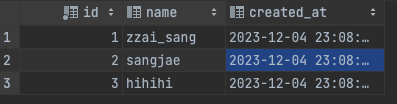
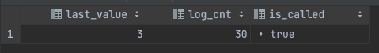

기존에 Mysql (mariaDB) 를 사용하셨던 분들이 PostgreSQL 을 사용하시게 되면 Truncate 의 차이점에 대해서 말 해보겠습니다.  
실무에서 잘 사용하지는 않지만 Table 의 모든 데이터를 삭제하고 싶을때 Truncate 를 사용합니다.

**차이점**

-   MySQL : Table Truncate 시 기본적으로 Data 및 Sequence 정보도 초기화 된다.
-   PostgreSQL : Table Truncate 시 기본적으로 Data 정보만 초기화 된다.

### 그럼 PostgreSQL 에서 PK 의 값을 1부터 시작하고 싶으면...?

> \`CONTINUE IDENTITY : Do not change the values of sequences. This is the default.  
> Truncate 옵션 중에 하나인 CONTINUE IDENTITY 공식문서에서는 해당처럼 Identity (PK값 주로 ID) 값을 변경하지 않는게 기본이라고 설명 되어 있습니다.

그래서, PK 의 Sequence 정보를 초기화 하고 싶으면 `RESTART IDENTITY` 정보를 추가 하면 됩니다.

```sql
TRUNCATE TABLE truncate_test; -- 데이터만 초기화
TRUNCATE TABLE truncate_test RESTART IDENTITY; -- sequence 정보도 초기화
```

**아래는 실제로 테이블을 생성해서 테스트 해본 내용입니다**

1.  `truncate_test` 라는 테이블 생성
    
    ```sql
     create table truncate_test  
     (  
         id         bigserial,  
         name       varchar(255),  
         created_at timestamp default now()  
     );
    ```
    
2.  데이터 추가 & 조회  
    
    
    
3.  sequence 정보 조회  
    
    
    
4.  그냥 Truncate 실행 시 sequence 정보  
    
    
    
5.  `RESTART IDENTITY` 추가 및 Truncate 실행 시 sequence 정보  
    
    
    

---

공식 문서 : [postgreSQL Truncate](https://www.postgresql.org/docs/current/sql-truncate.html)
