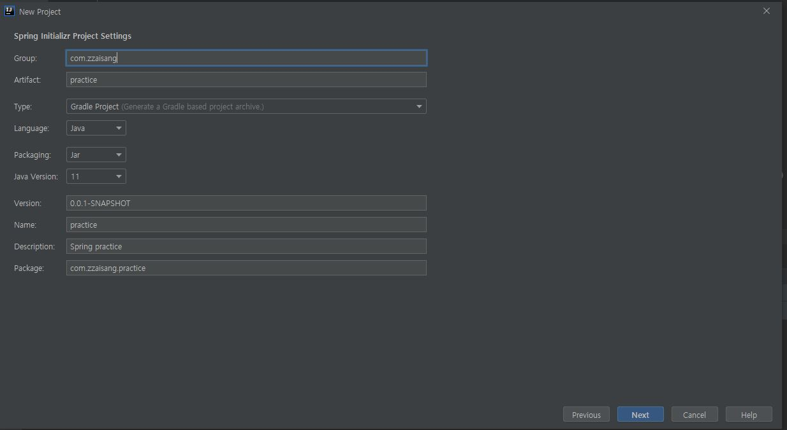
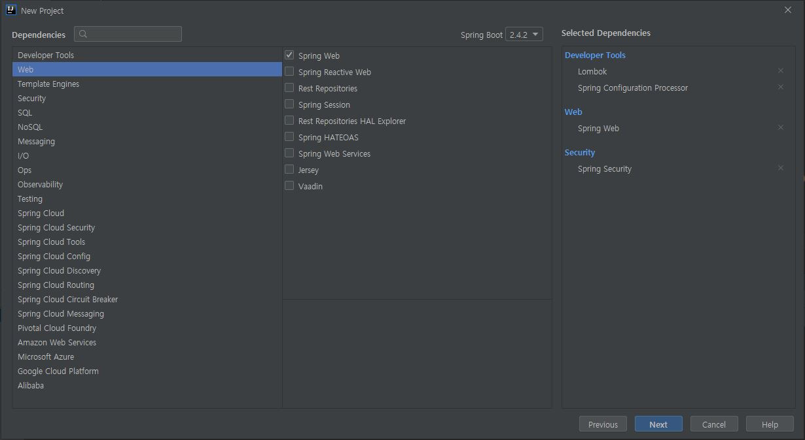
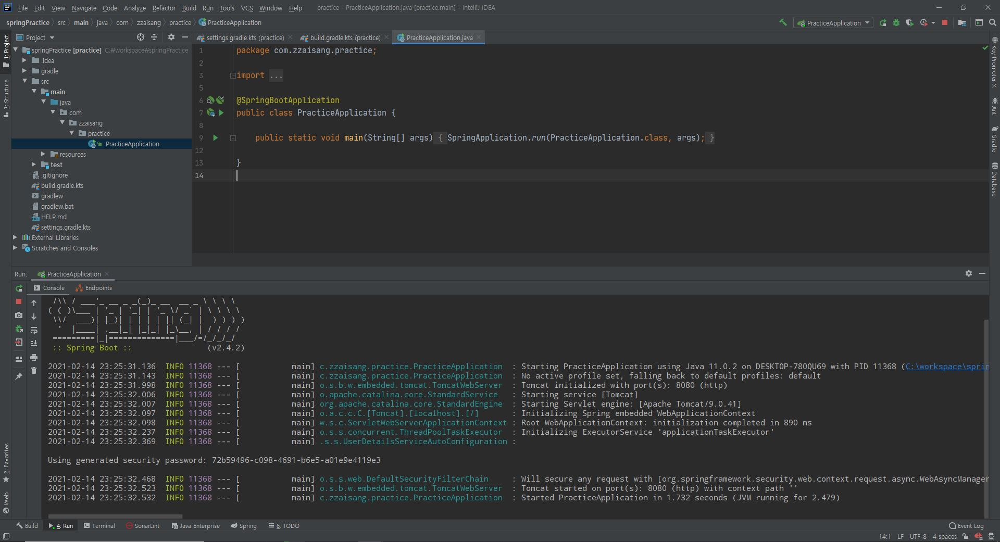

Version 

\- Intellij 2020.01

\- Java 11

\- Spring Boot 2.4.2

\- gradle

첨부사진1

첨부사진2 -dependencies 목록

실행화면

소스링크 : [github.com/zzaisang/springPractice](https://github.com/zzaisang/springPractice)
